# Training360-Szoftverarchitektúrák

## Standalone konzolos alkalmazás
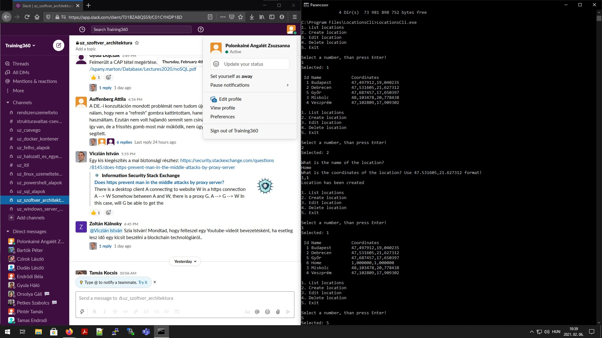
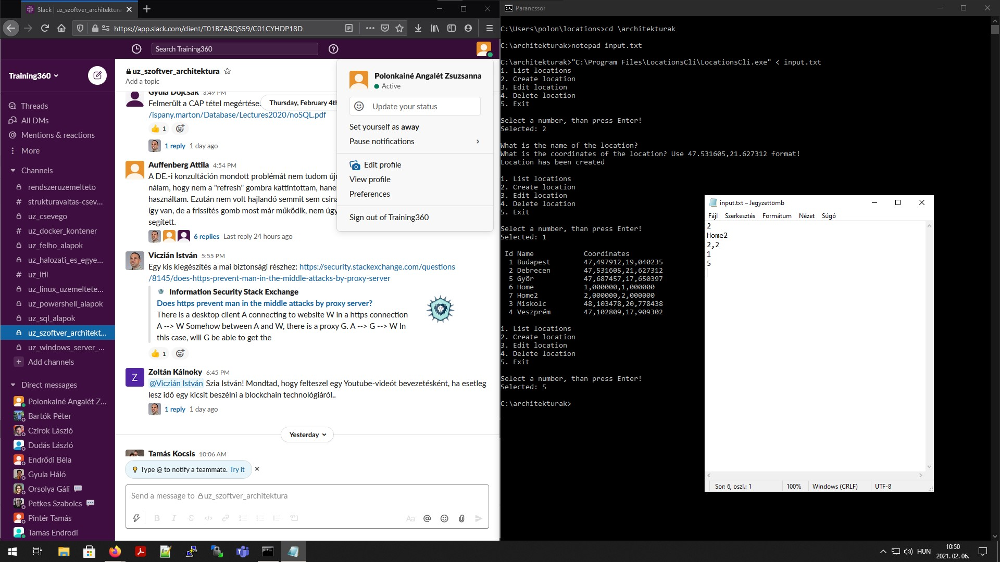

## Standalone alkalmazás grafikus felülettel
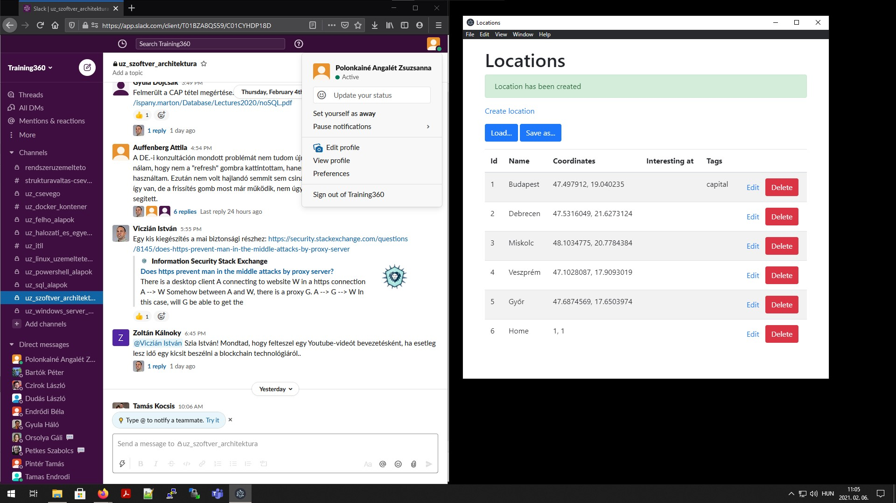
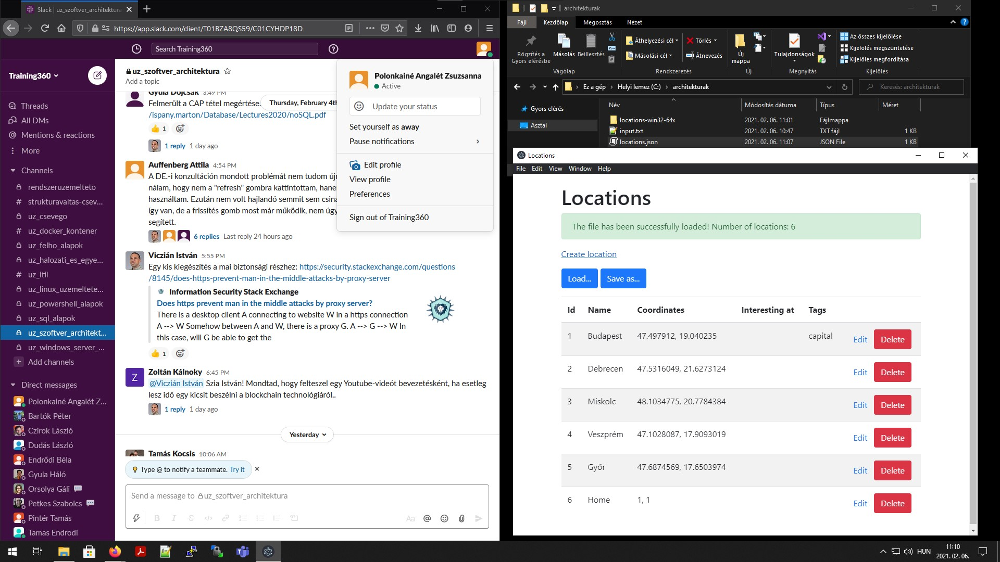

## Központi adatbázis
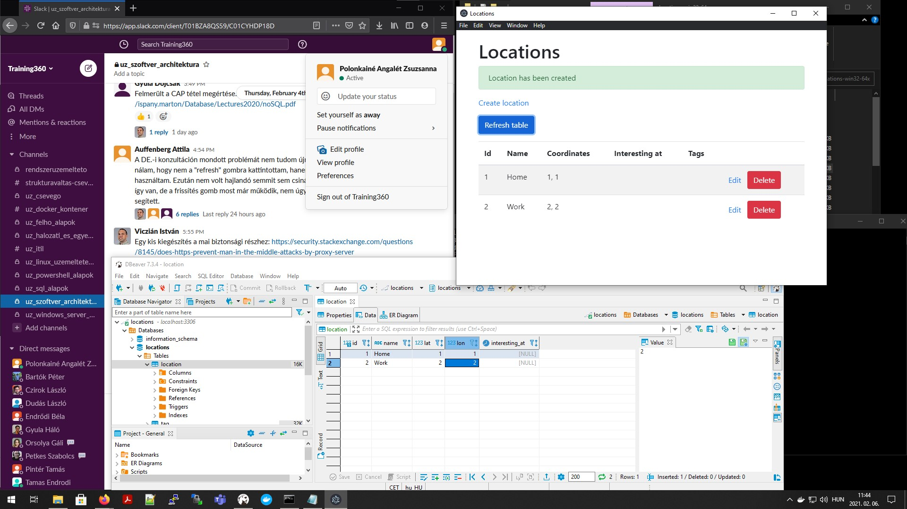

## SQL nyelv
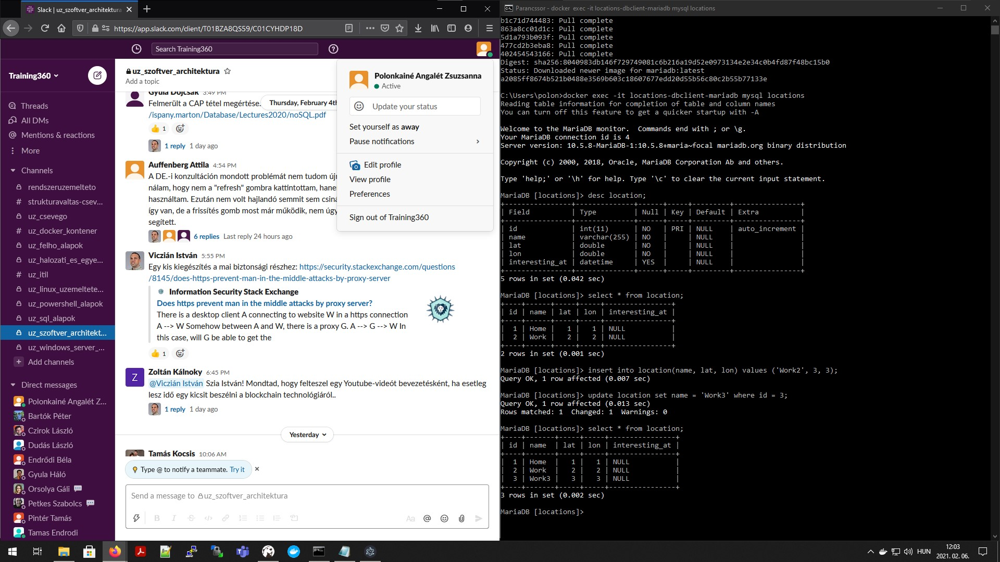
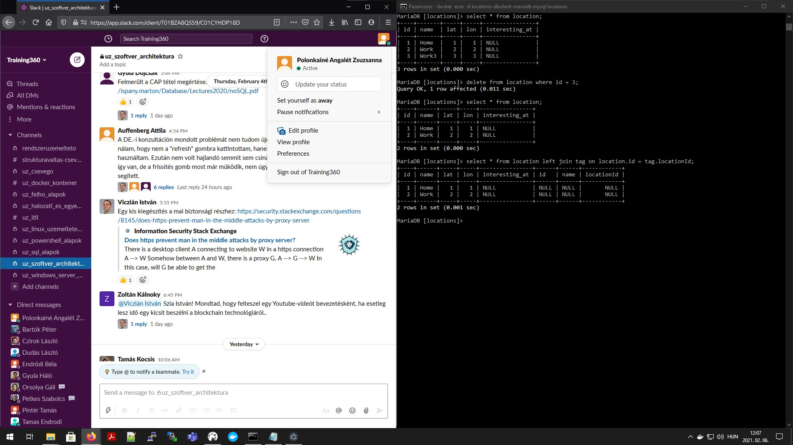

## NoSQL adatbázisok
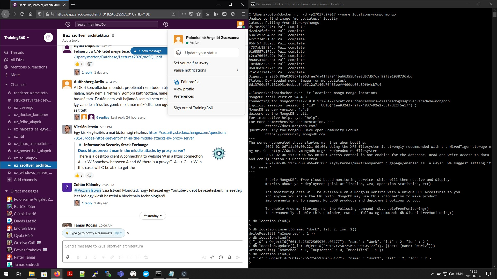

## Többrétegű alkalmazások
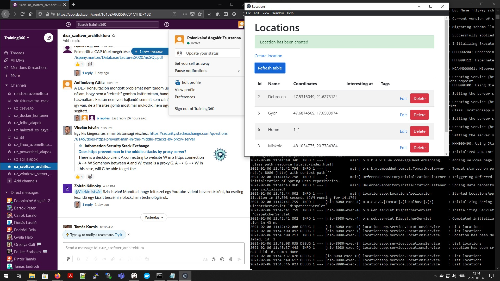

## Webes alkalmazás
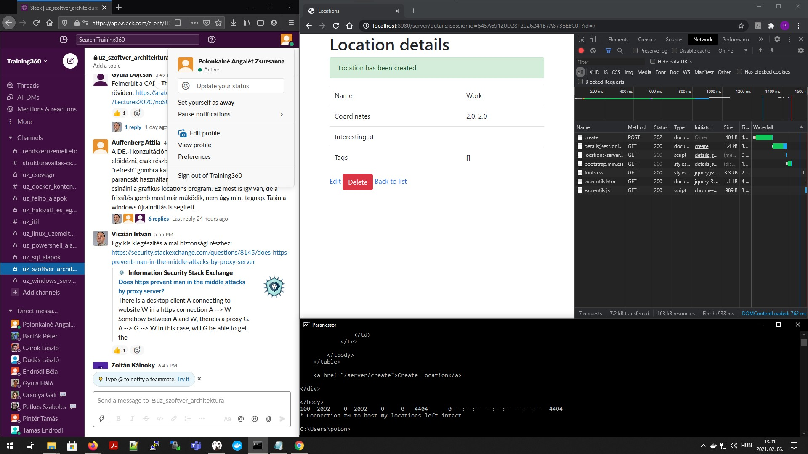

## Web formátumai: HTML és CSS
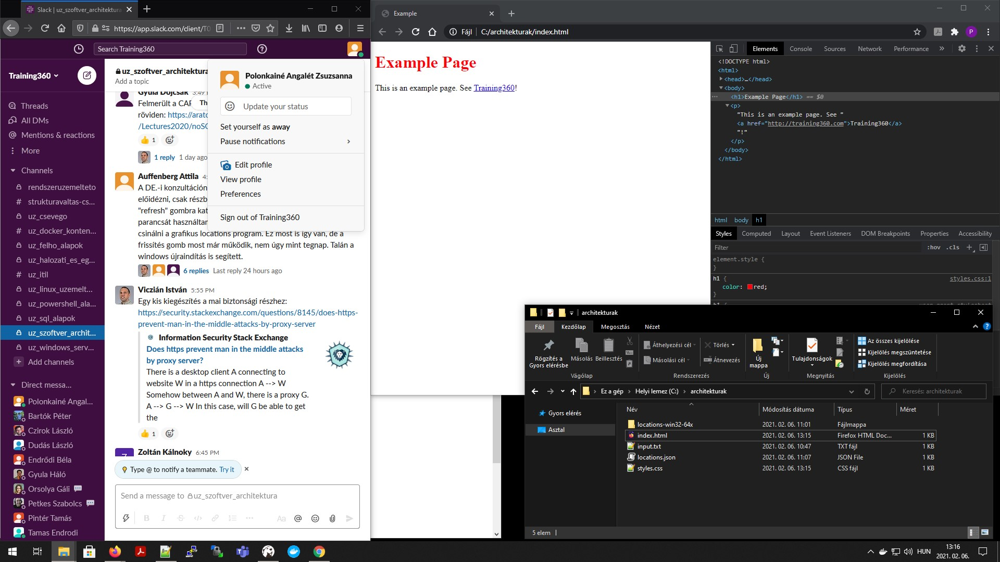
